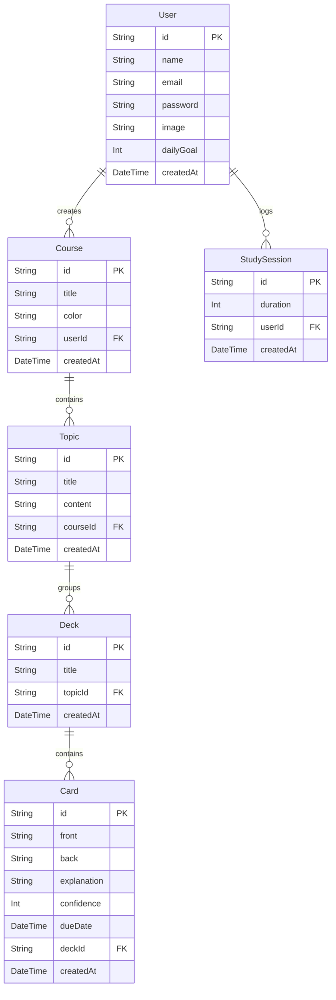

# 🧠 Synapse — Advanced Active Recall & Spaced Repetition Study Suite

Synapse is a high-fidelity, private web application designed to optimize learning retention through cognitive science principles. By combining client-side computing (for zero-latency processing) with state-of-the-art AI assistance, Synapse helps students and professionals master complex concepts faster.

---

## 🌟 Key Features

### 1. 🗂️ PDF-to-Deck Flashcard Generator
* **Browser-Native Extraction**: Loads the Mozilla `PDF.js` parsing engine client-side at runtime to extract plain text from lecture slides and textbook PDFs without server-side compute overhead.
* **AI Generation**: Pipes text to a Llama 3.3 model to instantly produce high-quality, conceptual active recall question/answer pairs.

### 2. 📅 14-Day Spaced Repetition Forecast Calendar
* **Review Load Forecasting**: Computes upcoming study loads by grouping card due dates from the database for the next two weeks.
* **Visual Workload Heatmap**: Uses a color-coded legend to represent review load weight (🟢 Light: 1-5 cards, 🟡 Medium: 6-15 cards, 🔴 Heavy: 16+ cards).
* **Relative Timeline**: Renders relative date labels (`Today`, `Tomorrow`) for immediate clarity, with interactive click actions to preview decks due on that day.

### 3. 🎙️ Voice-Activated Flashcards (Speech Recall)
* **Web Speech Recognition**: Uses the browser's native Web Speech API to capture verbal user answers live during flashcard review sessions.
* **Semantic Similarity Scorer**: Evaluates spoken answers against correct card backs using a keyword-matching string algorithm, displays matching accuracy on a progress bar, and suggests spaced repetition grades (e.g. *Easy*, *Good*, *Hard*, *Again*).

### 4. ⏱️ Pomodoro Focus Workspace
* **Brownian Noise Backdrop**: Synthesizes client-side lowpass-filtered Brownian noise (rain backdrop) using the Web Audio API (zero file downloads or external assets needed).
* **Document Title Sync**: Synchronizes countdown timers to the browser document tab title (e.g., `(24:18) Focus | Synapse`) to keep users on task even when switching tabs.

### 5. 🧑‍🏫 Feynman Technique & Practice Exams
* **Feynman Simulator**: Prompts users to explain a concept in simple terms, evaluates explaining coherence, and pinpoints knowledge gaps.
* **Practice Exams**: Generates dynamic 4-question Multiple Choice mock exams from study notes to test active recall retention.

---

## 🛠️ Technology Stack

* **Framework**: [Next.js 15](https://nextjs.org/) (App Router, Server Actions, and React Server Components)
* **Database & ORM**: [Prisma ORM](https://www.prisma.io/) with [PostgreSQL](https://www.postgresql.org/) (Hosted on serverless [Neon](https://neon.tech/))
* **Authentication**: [NextAuth.js v5](https://authjs.dev/) (Credentials Provider, Case-insensitive username/email matching)
* **AI Engine**: [Groq API](https://groq.com/) (Llama-3.3-70B for text processing and Llama-3.2-11B-Vision for optical document analysis)
* **Styling**: Tailwind CSS with custom spring keyframe entrance animations (`slideUp`, `scaleIn`, `float`, `fadeIn`)

---

## 📊 Database Schema Relationships



---

## 🚀 Local Installation & Setup

### 1. Prerequisites
Ensure you have [Node.js](https://nodejs.org/) (v18+) and [pnpm](https://pnpm.io/) installed.

### 2. Clone & Install Dependencies
```bash
git clone https://github.com/sandraNotTaken/synapse.git
cd synapse
pnpm install
```

### 3. Environment Variables (`.env`)
Create a `.env` file in the project root and populate the following values:

```env
# Database connection (Use Neon pooled endpoint for production speedups)
DATABASE_URL="postgresql://neondb_owner:npg_xxxxxx-pooler.c-9.us-east-1.aws.neon.tech/neondb?sslmode=require&connect_timeout=30"

# NextAuth Configuration
AUTH_SECRET="your_next_auth_secret_hash"
AUTH_URL="http://localhost:3000"

# Groq API Credentials
GROQ_API_KEY="gsk_xxxxxx"
```

### 4. Push Database Schema & Generate Client
```bash
npx prisma db push
npx prisma generate
```

### 5. Run the Development Server
```bash
pnpm dev
```
Open [http://localhost:3000](http://localhost:3000) to view the application.

---

## ⚡ Production Deployment & Performance Tuning

### 1. Neon Database Pooling (Crucial)
In stateless, serverless environments (like Vercel), TCP connection limits are easily saturated. 
* **Action**: Append the `-pooler` suffix to your Neon database hostname in the environment variables (e.g. `ep-cool-breeze-atv3cmqs-pooler.c-9.us-east-1.aws.neon.tech`). This routes query traffic through PgBouncer, cutting connection handshakes by up to 80%.

### 2. Client-Side Image Resizing
To prevent multi-megabyte Base64 image payloads from bloating server components and slowing down client transitions:
* **Action**: The profile avatar uploader automatically center-crops and compresses image uploads using a browser canvas to a `128x128` pixel JPEG at `80%` quality, keeping the database image footprint under `8KB`.

### 3. Enabling Forgot Password Email Recovery
To re-enable self-service password recovery:
1. Register for a free mail provider account on [Resend](https://resend.com).
2. Save your Resend API key as `RESEND_API_KEY` in your environment.
3. Configure the password reset tokens database table and update `app/forgot-password/actions.ts` to send email verification links containing secure temporary tokens.
